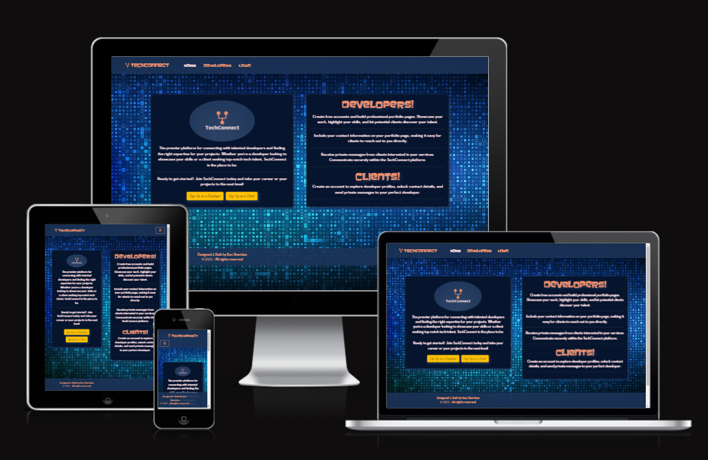

# TechConnect

## Your source for great tech talent
------------------------------------



### Live site available [here](https://www.tech-connect.ie). 
### Repo available [here](https://github.com/KSheridan86/TechConnect).


-----

## Getting Started

Follow these instructions to get the project up and running on your local machine.

### Prerequisites

- Python
- Node.js
- npm
- React
- Code Editor

### Installation

1. Open the project folder in your preferred code editor.

    or

2. Clone the repository:

    ```bash
    git clone https://github.com/KSheridan86/TechConnect.git
    ```


### Setting up the Backend

1. Open a terminal in the project directory.

2. Navigate to the `techconnect` folder:

    ```bash
    cd techconnect
    ```

3. Start the virtual environment:

    ```bash
    myenv\scripts\activate
    ```

4. Navigate into the `backend` folder:

    ```bash
    cd backend
    ```

5. Run the Django development server:

    ```bash
    python manage.py runserver
    ```

### Setting up the Frontend

1. Open a separate terminal in the project directory.

2. Navigate to the `techconnect/frontend` folder:

    ```bash
    cd techconnect/frontend
    ```

3. Install Node.js dependencies:

    ```bash
    npm install
    ```

4. Start the frontend development server:

    ```bash
    npm start
    ```

Open your web browser and go to [http://localhost:3000](http://localhost:3000) to view the application.
Open your web browser and go to [http://127.0.0.1:8000/](http://127.0.0.1:8000/api/users) to view the backend.

-----


## Author Info

Ken Sheridan, Full Stack Software Developer.
- [GitHub](https://github.com/KSheridan86)
- [Linkedin](https://www.linkedin.com/in/kensheridan86/)


[Back to the Top](#techconnect)